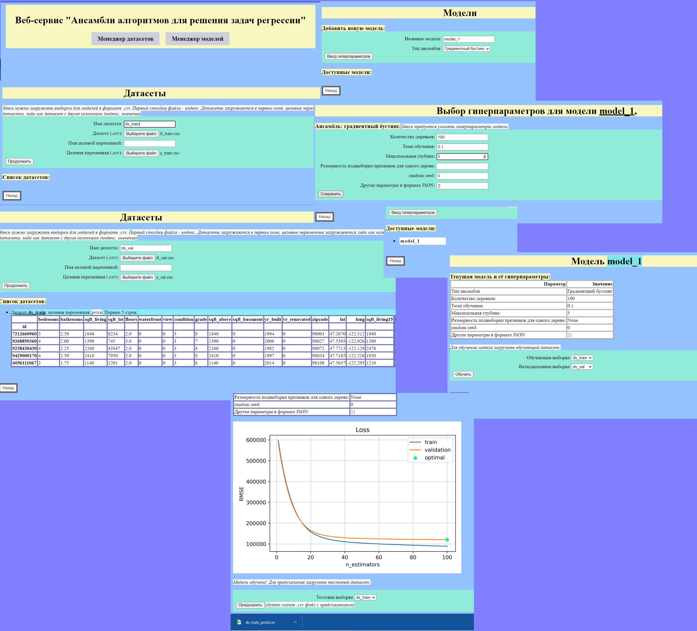

# mmf_ensemble_learning
 MMF practicum project "Ensemble learning on a web server"

Итоговый веб-сервис имеет простой, интуитивно понятный интерфейс:

Итак:
1. В папке data лежат исходные данные
2. В папке experiments лежат эксперименты и исходники к ним
3. В папке scripts лежат скрипты для сборки docker-контейнера у себя на машине: сначала запустить build.sh, потом run.sh. Веб-сервис будет доступен по адресу "http://localhost:5000/"
4. В папке src находятся две папки - одна с исходниками реализации моделей ансамблей (также они, на всякий случай, в папке src), другая - с исхожниками сервера.
5. В папке task находится условие задания
6. Также в папке app находится папка data с данными, на которых можно протестировать веб-сервис
7. Адрес на dockerhub: https://hub.docker.com/repository/docker/ksuglobov/mmf_ensemble_learning_fall_2021